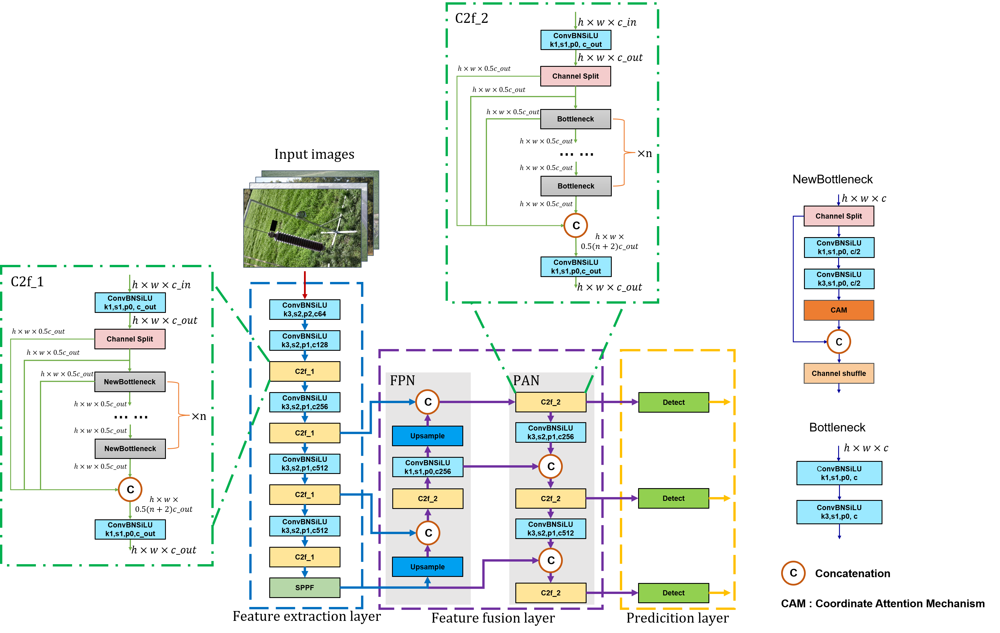

# CACS-YOLO: A Lightweight Model for Insulator Defect Detection based on improved YOLOv8m



​                                                        Fig. 1: Model architecture diagram of CACS-YOLO


## **Highlights**

1) By adding CAM based on feature reuse and feature CSO, a high-precision and lightweight insulator defect detection model CACS-YOLO was constructed, which achieved good results in both detection accuracy and lightweight.

2) The synthetic weather algorithms were used to enhance the data and construct a new dataset, which solved the problem of insufficient data and helped the model to further improve the detection accuracy.

3) The insulator dataset SFRID containing 20,567 insulator images, including foggy and rainy days, was constructed and released, so that the model can cope well with different weather conditions.

# Getting started

### 1. Get codes

```
git clone https://github.com/CACS-YOLO.git
cd CACS-YOLO
```

### 2. Installation of dependent libraries

```
pip install -r ./requirements.txt
```

### 3. Train model

To train the model, create a new python file and run the following code:

```
from ultralytics import YOLO

# Load CACS-YOLO
model = YOLO(model = './ultralytics/cfg/models/CACS-YOLO.yaml')
# Load YOLOv8m
# model = YOLO(model = './ultralytics/cfg/models/YOLOv8m.yaml')
# Load YOLOv8m-CAM
# model = YOLO(model = './ultralytics/cfg/models/YOLOv8m-CAM.yaml')
# Load YOLOv8m-CSO
# model = YOLO(model = './ultralytics/cfg/models/YOLOv8m-CSO.yaml')

# Training with UPID
model.train(data = './ultralytics/cfg/datasets/UPID.yaml', device = 0, epochs = 500)
# Training with SFID
# model.train(data = './ultralytics/cfg/datasets/SFID.yaml', device = 0, epochs = 500)
# Training with SRID
# model.train(data = './ultralytics/cfg/datasets/SRID.yaml', device = 0, epochs = 500)
# Training with SFRID
# model.train(data = './ultralytics/cfg/datasets/SFRID.yaml', device = 0, epochs = 600)
```

### 4. Test model

To test the model, create a new python file and run the following code:

```
from ultralytics import YOLO

# Load the best model
model = YOLO('./runs/detect/train/weights/best.pt')

# Testing with UPID
model.val(data = './ultralytics/cfg/datasets/UPID.yaml', device = 0)
# Testing with SFID
# model.val(data = './ultralytics/cfg/datasets/SFID.yaml', device = 0)
# Testing with SRID
# model.val(data = './ultralytics/cfg/datasets/SRID.yaml', device = 0)
# Testing with SFRID
# model.val(data = './ultralytics/cfg/datasets/SFRID.yaml', device = 0)
```

### 5. Inference

To infer the model, create a new python file and run the following code:

```
from ultralytics import YOLO

# Load the best model
model = YOLO("./runs/detect/train/weights/best.pt", task = "detect")

# Infer the model
result = model(source = "./data_example/000050.jpg", save = True)
```

### 6. Synthetic fog generation

You can use the image_synthetic_fog.py to generate foggy images. 

```
python ./image_synthetic_fog.py <Path of the image> <Brightness of the fog> <Thickness of the fog> <Save path of the image>

# Example
# python image_synthetic_fog.py ./data_example/000050.jpg 0.9 0.05 ./data_example/synthesis_effect/foggy_000050.jpg
```

### 7. Synthetic rain generation

You can use the image_synthetic_rain.py to generate rainy images. 

```
python ./Image_Synthetic_Rain.py <Path of the image> <Angle of raindrops> <Number of raindrops> <Width of raindrops> <length of raindrops> <Save path of the image>

# Example
# python image_synthetic_rain.py ./data_example/000050.jpg -30 600 5 60 ./data_example/synthesis_effect/rainy_000050.jpg
```

